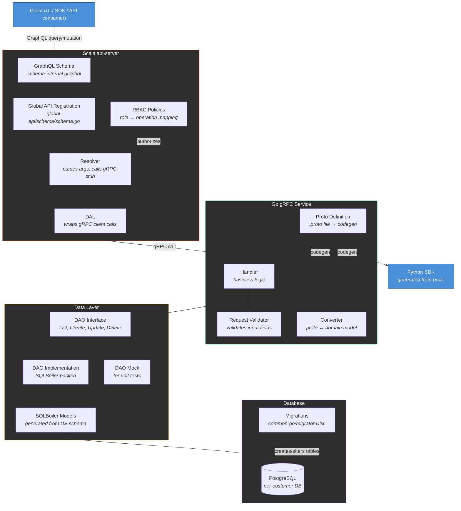

# Polaris Architecture Diagram

How a request flows through the stack — what each layer does and what it talks to.

```mermaid
graph TD
    Client["Client (UI / SDK / API consumer)"]

    subgraph apiserver ["Scala api-server"]
        GQL["GraphQL Schema<br/><i>schema-internal.graphql</i>"]
        RBAC["RBAC Policies<br/><i>role → operation mapping</i>"]
        Resolver["Resolver<br/><i>parses args, calls gRPC stub</i>"]
        DAL["DAL<br/><i>wraps gRPC client calls</i>"]
        GlobalAPI["Global API Registration<br/><i>global-api/schema/schema.go</i>"]
    end

    subgraph grpcservice ["Go gRPC Service"]
        Proto["Proto Definition<br/><i>.proto file → codegen</i>"]
        Validator["Request Validator<br/><i>validates input fields</i>"]
        Handler["Handler<br/><i>business logic</i>"]
        Converter["Converter<br/><i>proto ↔ domain model</i>"]
    end

    subgraph datalayer ["Data Layer"]
        DAOInterface["DAO Interface<br/><i>List, Create, Update, Delete</i>"]
        DAOImpl["DAO Implementation<br/><i>SQLBoiler-backed</i>"]
        DAOMock["DAO Mock<br/><i>for unit tests</i>"]
        Models["SQLBoiler Models<br/><i>generated from DB schema</i>"]
    end

    subgraph db ["Database"]
        PG[("PostgreSQL<br/><i>per-customer DB</i>")]
        Migration["Migrations<br/><i>common-go/migrator DSL</i>"]
    end

    SDK["Python SDK<br/><i>generated from proto</i>"]

    Client -->|"GraphQL query/mutation"| GQL
    GQL --> GlobalAPI
    GlobalAPI --> Resolver
    RBAC -->|"authorizes"| Resolver
    Resolver --> DAL
    DAL -->|"gRPC call"| Handler

    Handler --> Validator
    Handler --> Converter
    Handler --> DAOInterface
    Proto -.->|"codegen"| Handler
    Proto -.->|"codegen"| SDK

    DAOInterface --> DAOImpl
    DAOInterface -.-> DAOMock
    DAOImpl --> Models
    Models --> PG
    Migration -.->|"creates/alters tables"| PG

    style Client fill:#4a90d9,stroke:#2c5f8a,color:#fff
    style apiserver fill:#2d2d2d,stroke:#e8744f,color:#fff
    style grpcservice fill:#2d2d2d,stroke:#50b87a,color:#fff
    style datalayer fill:#2d2d2d,stroke:#f5a623,color:#fff
    style db fill:#2d2d2d,stroke:#9b6fcb,color:#fff
    style SDK fill:#4a90d9,stroke:#2c5f8a,color:#fff
```
