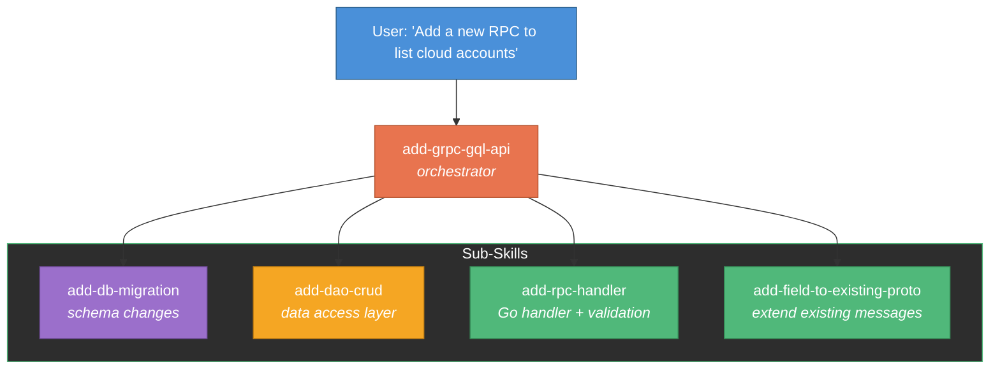

# Orchestrator + Sub-Skills

---

```mermaid
graph TD
    User["User: 'Add a new RPC to list cloud accounts'"]
    Orch["add-grpc-gql-api<br/><i>orchestrator</i>"]

    subgraph sub ["Sub-Skills"]
        DB["add-db-migration<br/><i>schema changes</i>"]
        DAO["add-dao-crud<br/><i>data access layer</i>"]
        RPC["add-rpc-handler<br/><i>Go handler + validation</i>"]
        Field["add-field-to-existing-proto<br/><i>extend existing messages</i>"]
    end

    User --> Orch
    Orch --> DB
    Orch --> DAO
    Orch --> RPC
    Orch --> Field

    style User fill:#4a90d9,stroke:#2c5f8a,color:#fff
    style Orch fill:#e8744f,stroke:#b5522d,color:#fff
    style sub fill:#2d2d2d,stroke:#50b87a,color:#fff
    style DB fill:#9b6fcb,stroke:#6d4a94,color:#fff
    style DAO fill:#f5a623,stroke:#c07d12,color:#fff
    style RPC fill:#50b87a,stroke:#358a56,color:#fff
    style Field fill:#50b87a,stroke:#358a56,color:#fff
```
