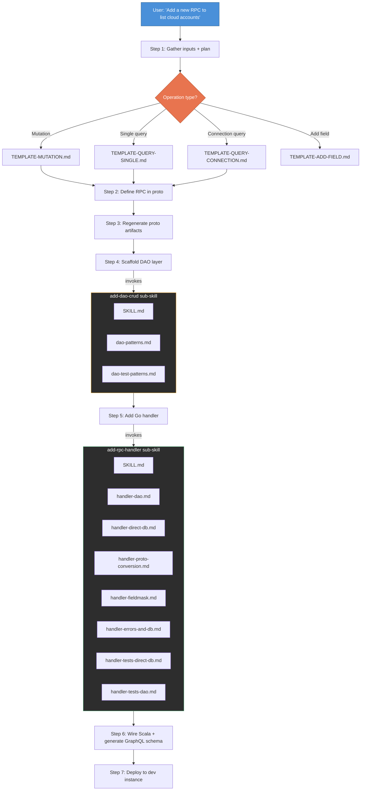

# Understanding the Full-Stack Skill

The `add-grpc-gql-api` skill is a single orchestrator that walks through the entire stack. It routes based on what you're trying to do, picks the right template, and delegates to focused sub-skills for the DAO and handler layers. Each sub-skill has its own reference patterns pulled from the actual codebase.

---

## Diagram

## Slide bullets

- **One entry point**: `add-grpc-gql-api` — the orchestrator
- **Plans with you first**: gathers inputs, asks clarifying questions, drafts a plan
- **Invokes sub-skills as needed**: each sub-skill is a focused specialist
- **Modular**: not every feature needs every sub-skill (e.g., skip DB migration if the table already exists)

## Speech

We built a Claude Code skill called `add-grpc-gql-api`. It's an orchestrator — one entry point that knows the whole stack. You describe what you want to build, it plans the work with you, then delegates to modular sub-skills: `add-dao-crud` for the data access layer, `add-rpc-handler` for the Go handler logic.

You interact with one skill. You don't need to know which sub-skills exist or invoke them manually — the orchestrator figures out what's needed. New table required? It scaffolds the DAO. Table already exists? Skips that step. Want to add a field to an existing proto instead of a whole new RPC? There's a separate workflow for that, and the orchestrator routes you there based on what you said.

Each sub-skill has its own reference patterns, templates, and conventions pulled from the actual codebase. They're not generic. They know Rubrik's patterns specifically.
