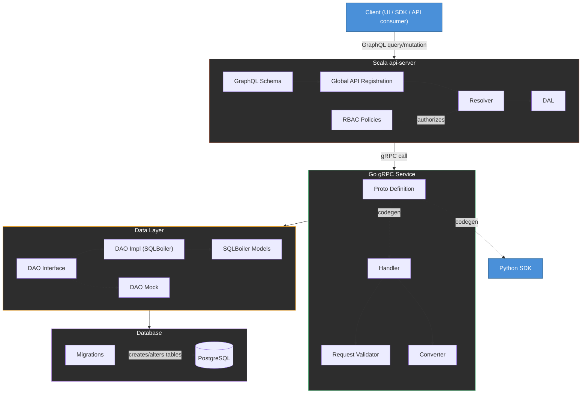
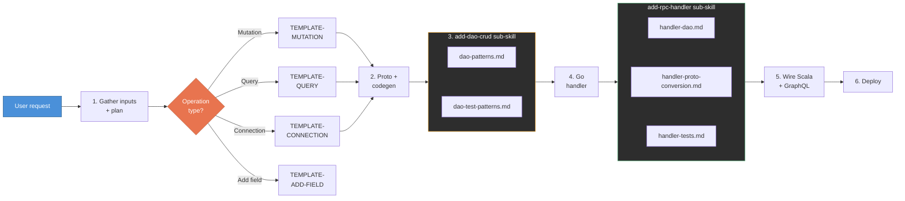

# Full Stack Engineering at Rubrik

What we'll cover:

- The product engineer mentality shift
- What "full stack" actually means here
- The new fullstack-orchestrator skill
- Other useful skills
- Debugging tools
- Advice for getting started
- Other resources

---

# Mentality Shift: The Product Engineer

Claude has added an abstraction layer to our work. Working in foreign domains is genuinely easier now.

- **Specialist to T-shaped**: the trend is toward engineers who deliver features end-to-end
- **Own the product**: you don't wait on a backend engineer because you *are* the backend engineer
- **Better product sense**: you understand the full experience, not just a mock handed to you
- **It's a process**: backend devs started doing frontend and weren't great at first. They got better. Same applies here.

---

# What "Full Stack" Means at Rubrik

A client request flows through six layers, three languages, and dozens of files.

<MermaidTooltips :tooltips="{
  Client: 'The caller — Polaris UI, Python SDK, or direct API consumer.',
  GQL: 'Defines the GraphQL types, queries, and mutations exposed to clients.',
  GlobalAPI: 'Registers each GraphQL endpoint so the api-server knows how to route incoming requests.',
  RBAC: 'Role-based access control policies that gate which users can call which resolvers.',
  Resolver: 'The function that executes a GraphQL query or mutation — calls downstream services via the DAL.',
  DAL: 'Data Access Layer — a Scala abstraction that translates resolver calls into gRPC requests to backend services.',
  Proto: 'Protobuf definition files — the source of truth for the gRPC API contract. Used for codegen.',
  Handler: 'Go function that implements the gRPC endpoint — contains business logic, validation, and conversion.',
  Validator: 'Validates incoming gRPC request fields before processing.',
  Converter: 'Converts between protobuf types and internal/DAO types.',
  DAOInterface: 'Go interface for data access — allows swapping real DB calls for mocks in tests.',
  DAOImpl: 'Concrete implementation of the DAO interface using SQLBoiler-generated code.',
  DAOMock: 'Mock implementation of the DAO interface used in unit tests.',
  Models: 'Go structs auto-generated by SQLBoiler from your database schema.',
  Migration: 'SQL migration files that create or alter database tables.',
  PG: 'Per-customer PostgreSQL database — the actual data store.',
  SDK: 'Auto-generated Python SDK client, built from the same proto definitions.',
}">
<Zoom>

</Zoom>
</MermaidTooltips>

---

# The Fullstack-Orchestrator Skill

The goal: make full stack work as simple as possible. One skill, one entry point, the entire stack handled for you.

`/fullstack-orchestrator` — a one-stop shop.

- **Plans with you first**: gathers inputs, asks clarifying questions, drafts a plan
- **Invokes sub-skills as needed**: routes by operation type, delegates to focused sub-skills — each encapsulates its own logic so Claude's context isn't flooded with irrelevant patterns
- **Modular**: not every feature needs every sub-skill — saves context by only loading what's relevant
- **This is an MVP** — needs your contributions to get where frontend tooling is

---

# Orchestrator Step-by-Step

<MermaidTooltips :tooltips="{
  User: 'You describe the feature you want — a new mutation, query, or field.',
  S1: 'The orchestrator asks clarifying questions and drafts a step-by-step plan before writing any code.',
  Route: 'Routes to the right template based on whether you need a mutation, query, connection, or new field.',
  TM: 'Template for creating a new GraphQL mutation — includes proto, handler, and Scala wiring.',
  TQ: 'Template for creating a new GraphQL query.',
  TQC: 'Template for creating a paginated connection query.',
  TAF: 'Template for adding a field to an existing type.',
  S2: 'Defines the protobuf contract and runs codegen to generate Go and Scala stubs.',
  DAO_PAT: 'Reference patterns for writing DAO CRUD operations with SQLBoiler.',
  DAO_TEST: 'Reference patterns for DAO unit tests.',
  S5: 'Implements the Go gRPC handler — business logic, validation, conversion.',
  RPC_DAO: 'Patterns for how the handler interacts with the DAO layer.',
  RPC_CONV: 'Patterns for converting between proto types and internal types.',
  RPC_TEST: 'Patterns for handler unit tests.',
  S6: 'Registers the new endpoint in the Scala api-server and wires up the GraphQL schema.',
  S7: 'Deploys the affected services to your dev environment.',
}">
<Zoom>

</Zoom>
</MermaidTooltips>

---

# Other Useful Skills

### `/deployment`
Builds and deploys to a dev environment. Only rebuilds the services your changes actually touch.

### `/bug-hunt`
Investigates bugs across layers. Give it a description or JIRA ticket, it traces through the code to identify root causes.

### `/code-walk`
Fast code navigation using Universal Ctags. Find definitions, trace callers, list struct members — roughly 4x faster than grep.

---

# Debugging Tools

### Logz MCP — your backend console
Think of it like `console.log`, but for every service at once. Query logs directly from Claude Code — Lucene syntax, filter by level, time range, deployment, component.

### Chronosphere MCP — your backend Network tab
Server-side latency, error rates, throughput. Same idea as the browser Network tab, but from the server's perspective across all services.

---

# Advice for Getting Started

- **Find a mentor**
- **Start with low-pressure work**
- **Understand the code you write**
- **Don't bite off more than you can chew**
- **Use code review**
- **Fullstack knowledge improves your frontend code**

---

# Other Resources

### Architecture & Flow
- [Polaris Database End-to-End Flow Diagram](https://rubrik.atlassian.net/wiki/spaces/SPARK/pages/2319908950) — full DB request path, including ProxySQL
- [Guide to Adding Basic APIs in Polaris](https://rubrik.atlassian.net/wiki/spaces/SPARK/pages/1370226689) — migration, proto, Go service, Scala GraphQL

### Deployment Access
- [Getting Access to a Polaris GCP Dev Deployment](https://rubrik.atlassian.net/wiki/spaces/SPARK/pages/2444428588) — how to get and verify access to dev GCP projects

---

# Closing

You've probably seen backend devs ship questionable frontend code early on, then steadily improve. That's what your learning curve will look like too.
