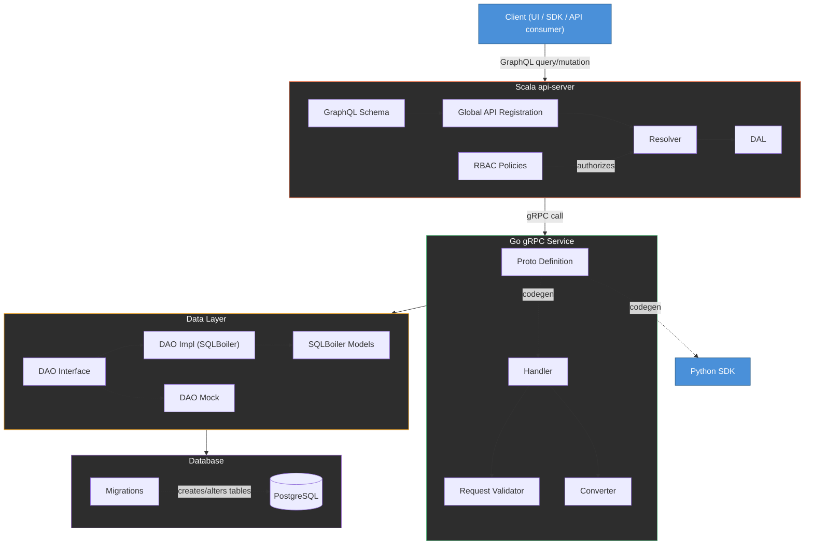
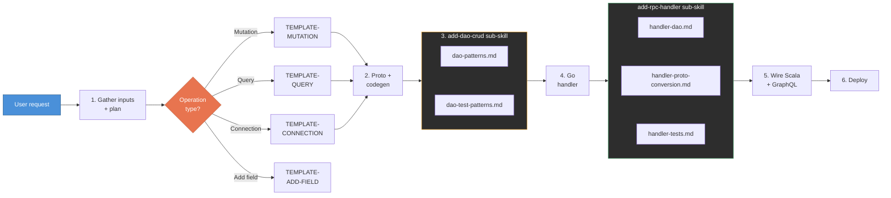

# Full Stack Engineering at Rubrik

What we'll cover:

- The product engineer mentality shift
- What "full stack" actually means here
- The new fullstack-orchestrator skill
- Other useful skills
- Debugging tools
- Advice for getting started
- Other resources

---

# Mentality Shift: The Product Engineer

Claude has added an abstraction layer to our work. Working in foreign domains is genuinely easier now.

- **Specialist to T-shaped**: the trend is toward engineers who deliver features end-to-end
- **Own the product**: you don't wait on a backend engineer because you *are* the backend engineer
- **Better product sense**: you understand the full experience, not just a mock handed to you

---

# What "Full Stack" Means at Rubrik

A client request flows through six layers, three languages, and dozens of files.

<MermaidTooltips :tooltips="{
  Client: 'The caller — Polaris UI, Python SDK, or direct API consumer.',
  GQL: 'Defines the GraphQL types, queries, and mutations exposed to clients. You already know this layer.',
  GlobalAPI: 'Registers each GraphQL endpoint so the api-server knows how to route incoming requests.',
  RBAC: 'Role-based access control — determines which users are allowed to call which endpoints.',
  Resolver: 'The function that runs when a GraphQL query or mutation is called. Think of it like a route handler.',
  DAL: 'Data Access Layer — translates resolver calls into gRPC requests to the Go backend services.',
  Proto: 'Protocol Buffer definition files (.proto). Think of them like a typed schema for backend APIs — similar to how GraphQL defines the contract between frontend and api-server, proto files define the contract between the api-server and Go services. You write the proto, run codegen, and it generates Go server stubs and client code automatically.',
  Handler: 'Go function that implements the gRPC endpoint. This is where business logic lives — validation, conversion, database calls.',
  Validator: 'Validates incoming request fields before processing.',
  Converter: 'Converts between protobuf types and internal types. Similar to mapping API response shapes to your frontend models.',
  DAOInterface: 'DAO = Data Access Object. It is the layer between business logic and the database. This interface defines the methods (e.g. Create, Get, Update, Delete) without specifying how they talk to the DB — so you can swap in mocks for testing.',
  DAOImpl: 'The real implementation of the DAO interface. Uses SQLBoiler (an ORM that generates Go code from your DB schema) to run actual SQL queries.',
  DAOMock: 'A fake implementation of the DAO interface used in unit tests — returns canned data instead of hitting a real database.',
  Models: 'Go structs auto-generated by SQLBoiler from your database schema. Similar to TypeScript types generated from GraphQL.',
  Migration: 'SQL files that create or alter database tables. Runs in order to keep the schema in sync across environments.',
  PG: 'Per-customer PostgreSQL database.',
  SDK: 'Auto-generated Python SDK client, built from the same proto definitions.',
}">
<Zoom>

</Zoom>
</MermaidTooltips>

---

# The Fullstack-Orchestrator Skill

The goal: make full stack work as simple as possible. One skill, one entry point, the entire stack handled for you.

`/fullstack-orchestrator` — a one-stop shop.

- **Plans with you first**: gathers inputs, asks clarifying questions, drafts a plan
- **Invokes sub-skills as needed**: routes by operation type, delegates to focused sub-skills — each encapsulates its own logic so Claude's context isn't flooded with irrelevant patterns
- **Modular**: not every feature needs every sub-skill — saves context by only loading what's relevant
- **This is an MVP** — needs your contributions to get where frontend tooling is

---

# Orchestrator Step-by-Step

<Zoom>

</Zoom>

---

# Other Useful Skills

### `/deployment`
Builds and deploys to a dev environment. Only rebuilds the services your changes actually touch.

### `/bug-hunt`
Investigates bugs across layers. Give it a description or JIRA ticket, it traces through the code to identify root causes.

### `/implementation-explainer`
Walks you through a PR or implementation plan you generated with Claude Code. Socratic Q&A — asks you questions about what was built and why, so you actually understand the code you're shipping.

### `/code-walk`
Fast code navigation using Universal Ctags. Find definitions, trace callers, list struct members — roughly 4x faster than grep.

### `/polaris-codegen`
Runs proto codegen (Go stubs, Python SDK, etc.). The fullstack-orchestrator calls this automatically, but you can run it standalone if you're iterating on proto changes outside the orchestrator.

---

# Debugging Tools

### Logz MCP — your backend console
Think of it like `console.log`, but for every service at once. Query logs directly from Claude Code — Lucene syntax, filter by level, time range, deployment, component.

### Chronosphere MCP — your backend Network tab
Server-side latency, error rates, throughput. Same idea as the browser Network tab, but from the server's perspective across all services.

---

# Advice for Getting Started

- **Find a mentor**
- **Start with low-pressure work**
- **Understand the code you write**
- **Don't bite off more than you can chew**
- **Use code review**
- **Fullstack knowledge improves your frontend code**
- **Multitask**: the skill is slow and deliberate — run it in a separate worktree and keep doing frontend work in your main branch
- **It's a process**: backend devs started doing frontend and weren't great at first. They got better. Same applies here.

---

# Other Resources

### Architecture & Flow
- [Polaris Database End-to-End Flow Diagram](https://rubrik.atlassian.net/wiki/spaces/SPARK/pages/2319908950) — full DB request path, including ProxySQL
- [Guide to Adding Basic APIs in Polaris](https://rubrik.atlassian.net/wiki/spaces/SPARK/pages/1370226689) — migration, proto, Go service, Scala GraphQL

### Deployment Access
- [Getting Access to a Polaris GCP Dev Deployment](https://rubrik.atlassian.net/wiki/spaces/SPARK/pages/2444428588) — how to get and verify access to dev GCP projects
